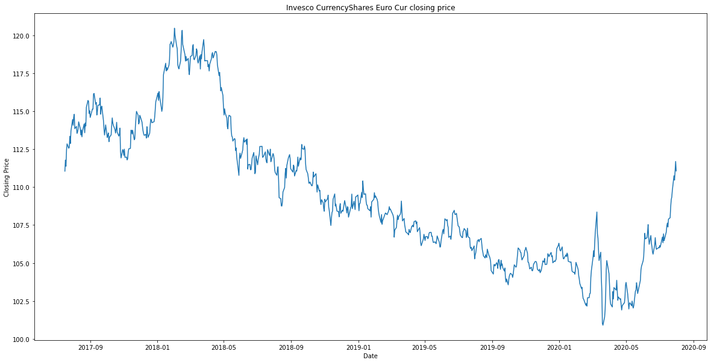
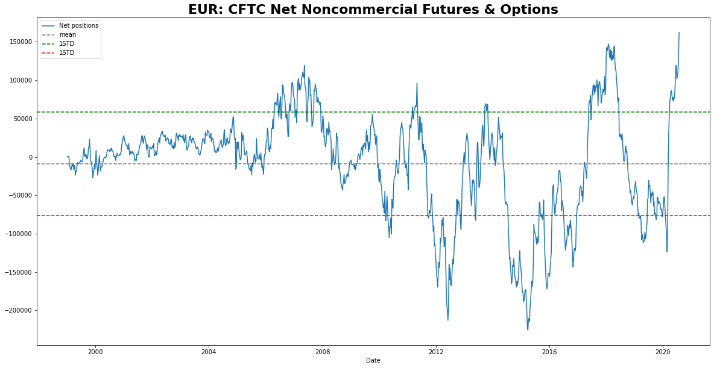
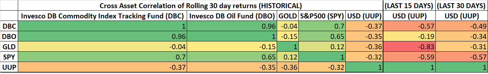
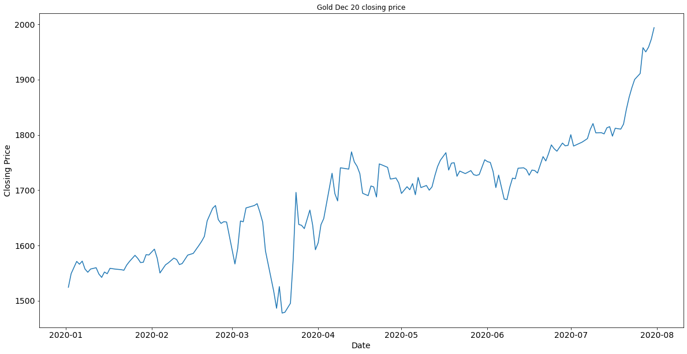
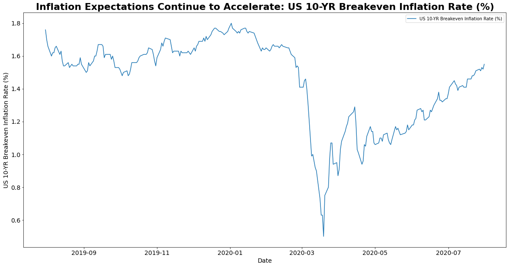
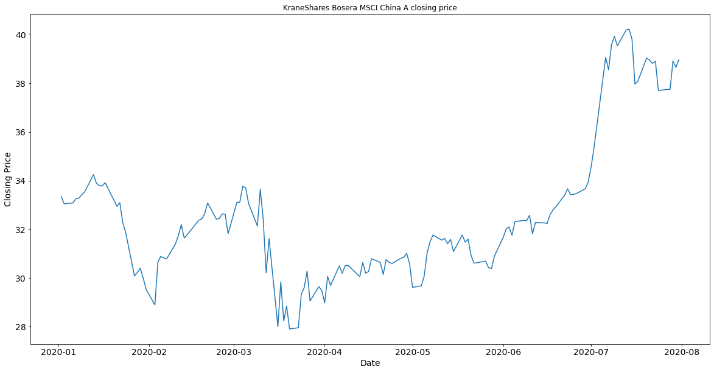
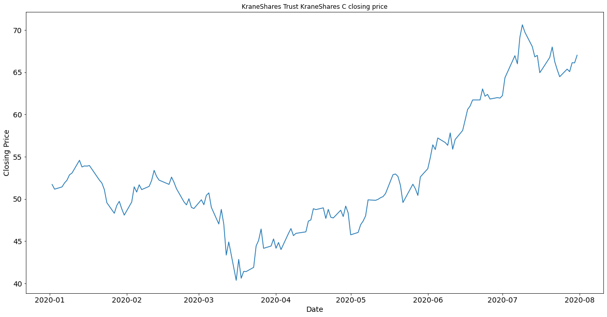
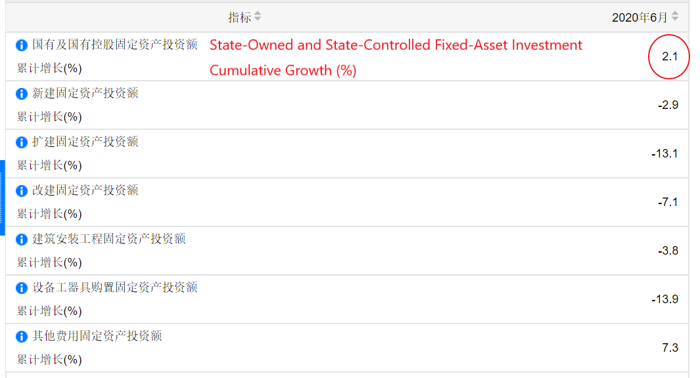
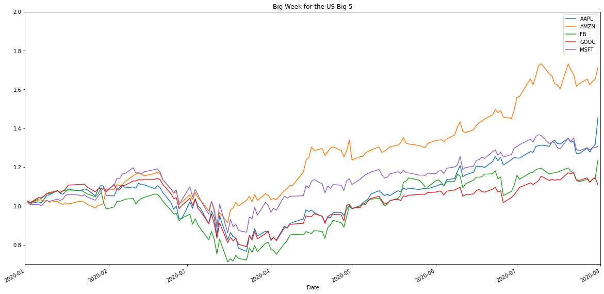

# Macro Round-up

## Currencies
Putting FX decisions at the front of your investment process gives greater clarity to the macro influence on your investments and creates greater margin for error on your core investment ideas. With that, the story of the past month isn't US Tech, Robinhood/Davey Day Trader, or crypto its the US dollar.

### Crowding into the long Euro trade
With the FED burning the USD at the stake, long Euro has been a decent trade the last couple weeks (see below):

However CFTC Commitments of Traders data seems to show this trade has gotten fairly crowded recently.

The fundamental story on USD is still negative, meaning commodities, Gold, Chinese equities, etc.. are all provided a strong tailwind going forward.

BUT with inverse correlations to USD over the last several days at elevated levels (see below), it would be prudent to wait for some of this short USD positioning to get cleared out before adding to those positions.

## Gold continues to scream higher, why? 

As mentioned the US on a whole, through monetary and fiscal measures, has been dramatically more stimulative than any other region in the world. 
So Gold (priced in US dollars) is simply reflecting this reality, while also pushing higher because: 
(i) fears of fiat currency debasement
(ii) decling real yields 
(iii) accelerating inflation expectations (higher inflation + no growth = stagflation) (see below)

## China: a changing investment story

Chinese equities still look attractive here for two reasons. First, there's shift going on in Chinese asset markets from a tendency to view the stock market as more of a casino and housing as your primary investment tool. Foreign inflows and an established regulatory response to housing speculation has altered the mindset of Chinese investors and is leading to a long-awaited maturity in Chinese equity markets.

Second, a declining USD now is conducive to a more stable macro environment for China. Lower USD keeps import prices (most importantly commodities) pinned lower. This is critical, as one of the largest short-term threats to the Chinese economy is rapidly accelerating food prices (both from its impact on the consumer and social stability). 

Food inflation in China is now in double-digits. In fact, despite the declines in global demand for crops like Corn, local prices have preciptously moved upwards. Despite prices for US corn futures having fallen roughly 12 per cent since lockdowns first started in China, corn futures traded in Dalian have risen more than 20%.

FED actions, COVID-19 and a global depression doesn't ameliorate any of the core problems facing the Chinese economy however. Medium term growth looks like it will accelerate over the next couple quarters for China and their recovery looks like it is on more solid footing than most Western countries (namely the US). And with limited investment opportunities in US equities and a subdued USD, Chinese equities look like they could continue to move higher over the next several months.

 However, over-investment in bloated State-Owned enterprises, in real-estate and in infrastructure continues(see below for 2020 First half fixed-asset investment growth in China) and hopes that the pandemic would accelerate China's transition to a consumer based economy is simply not being reflected in the data.

## US Big Tech Names Have A Huge Week

Based on last week's closing prices, the market capitalization of Apple, Amazon, Google and Facebook is now just shy of $5 Trillion USD.
These 4 companies earnings results this week did far more to reinforce the monopolistic nature of these companies than Congress was ever going to accomplish grilling these CEO's over Zoom..

Amazon in particular shocked the market reporting revenue of almost $90 billion, that was up more than 40 per cent YOY. In fact their net income doubled, even after spending $4bn on coronavirus-related expenses.

Add in Microsoft and these 5 companies now account for more than 20% of the total Market Capitalization of the S&P500.

